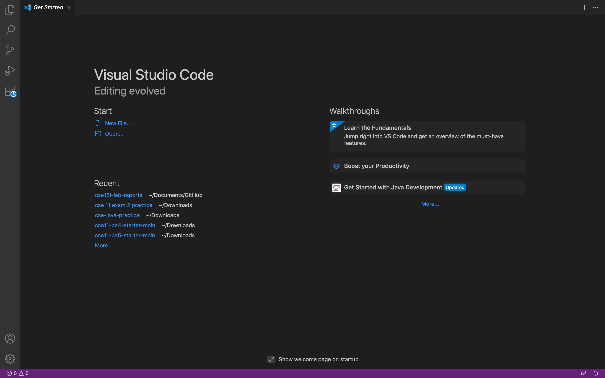
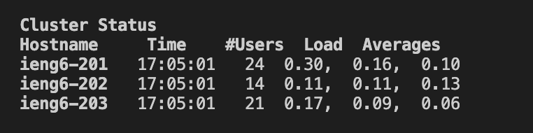
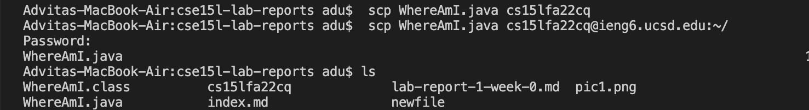
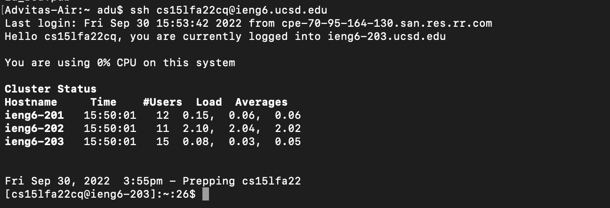
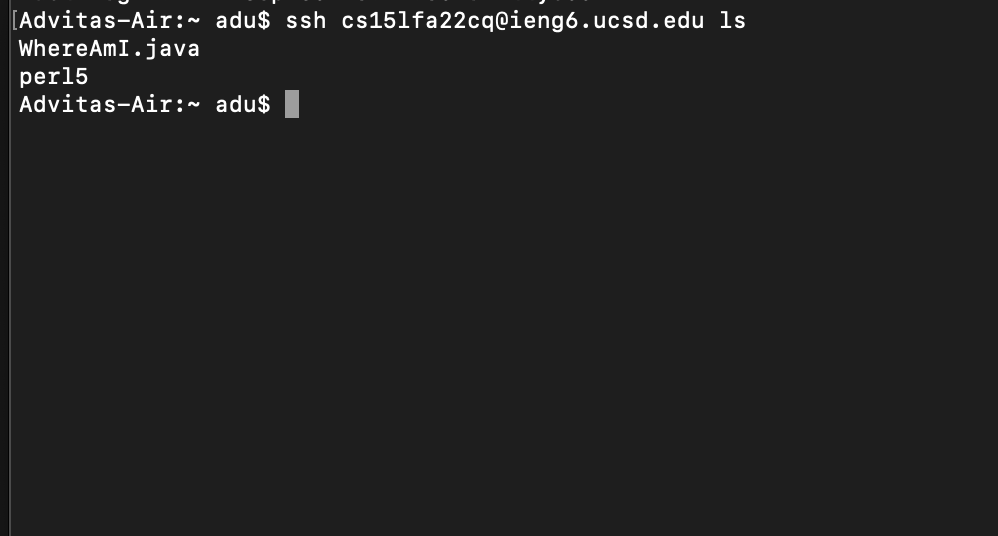

#  Lab Report 1
## *Advita Sekar*

[Home](index.html)

This is a tutorial on how to log in to a course specific account on ieng6.

In order to do this, follow the steps below closely:

**Install VS code:**  
To install VS code, go to [Visual Studio Code] (https://code.visualstudio.com/). You can download VS code on to your computer now. Once installed, this is what you should see:

**Resetting Password**  
1. Go to (https://sdacs.ucsd.edu/~icc/index.php)  
2. Input your UCSD username and PID  
3. Click the blue button that says Submit  
4. You will be able to see your course specific account on top. It should look like this :  
cs15lfa22zz  
5. Once you click on your account name you will be directed to a page where you can change your password.  
6. Enter your current password as well as your new password by following the isntruction provided to you. Make sure to include upper case letters, lower case letters, numbers, and symbols in your new password. Do not click the check password button as it will make you enter a new password again. All you have to do is select yes in the dropdown menu of the last input field and press enter/return on your keyboard.  
7. If you do this succesfully, you will be redirected to a page that says your password has been changed.  
8. Wait for 15-60 minutes and then follow the steps given below.  

**Remotely connecting:**  
Open a new terminal and log in using the ssh command and your username. The command is :
`ssh cs15lfa22cq@ieng6.ucsd.edu`
Ensure to enter your own username

After doing this enter your password. If you are connecting for the first time, you will receive a message asking if you want to connect. Respond with a yes. After successfully connecting you should see this: 

 **Running commands:**  
Once you have logged in you can run various commands some of which are :
* `cd`- change directory
* `ls`- see the list of files in your directory
* `mkdir`- make a new directory
* `pwd`- print working directory
 Here I have run the mkdir command:

 

**Moving Files over SSH with scp:**  
 To copy a file from your computer to a remoter operator, use the command `scp` on your own computer. Now, log out of ieng6 by using the command `exit` or `Ctrl+D`. Create a new file on vs Code and save it. Mine is called WhereAmI.java. Use the `javac` command to compile it and the `java` command to run it. To copy the file use the command:
 `scp WhereAmI.java cs15lfa11cq@ieng6.ucsd.edu:~/`

 Log in with you password. Now use the ls command. You should see the new java file here:
 

**Setting up SSH keys:**  

 The aim of this step is to be able to log in to `ieng6` without having to enter your password. This can be done using the `ssh-keygen` command which creates a public key and a private key - id_rsa.pub and id_rsa respectively. Now, log in to the server and use `mkdir` to create a directory named .ssh. Then log out using `exit` and type the following command:
 `scp /Users/adu/ .ssh/id_rsa.pub`
 `cs15lfa22zq@ieng6.ucsd.edu:~/ .ssh/authorized_leys`
This is now set up. You no longer need to enter your password. It should appear like this:

**Optimizing Remote Running:**  
To run commands more easily and efficiently you can either :
* write the command in quotes after the ssh command directly
* write multiple commands together and seperate them using semi-colons in the same line. 
 Here is an example:

 
