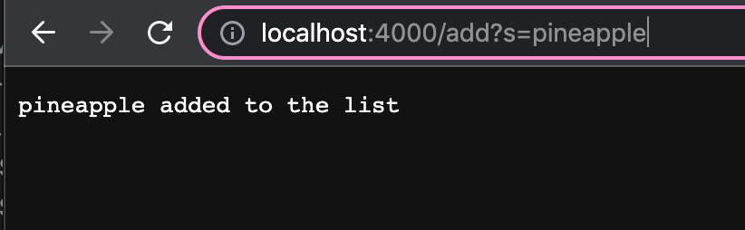
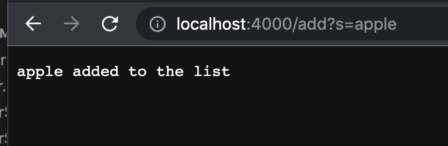
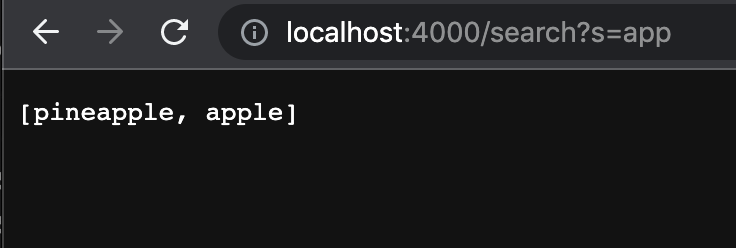
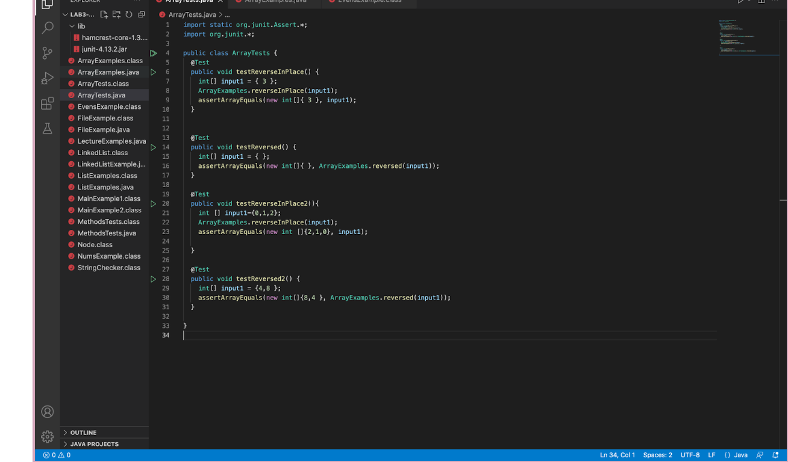
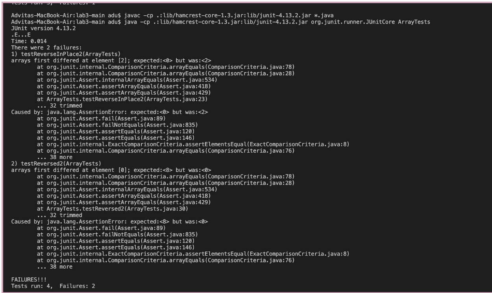
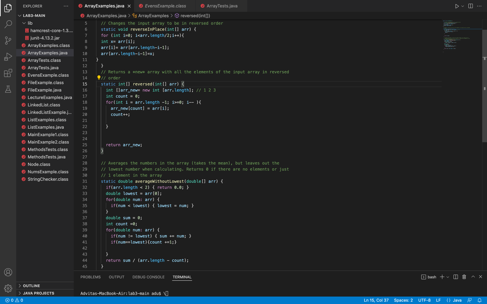
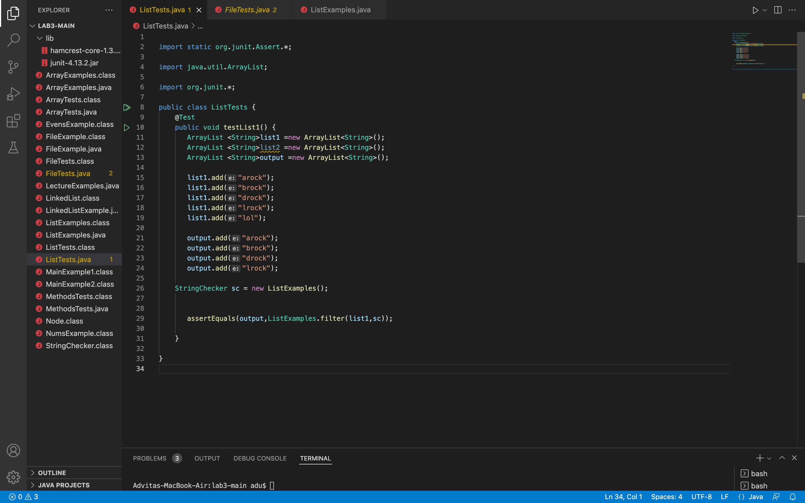
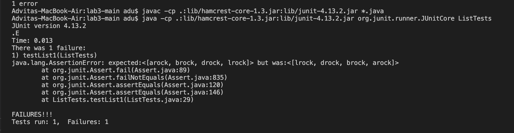
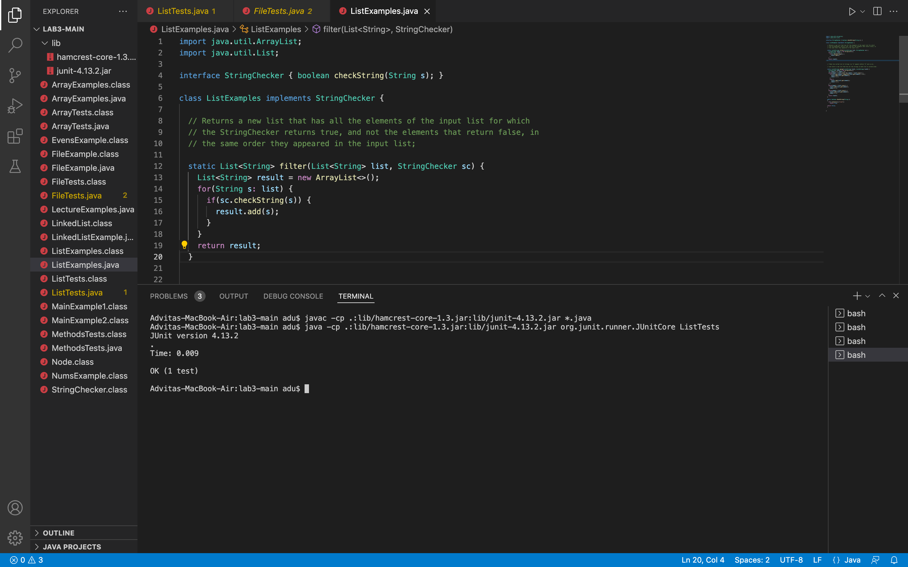

#  Lab Report 2
## *Advita Sekar*

[Home](index.html)

### Part 1  
**Simple SearchEngine**

In order to create the SearchEngine, I ran the following code:  
    
    import java.io.IOException;
    import java.net.URI;
    import java.util.ArrayList;

    class Handler implements URLHandler {

    ArrayList<String> vals = new ArrayList<>(); 

    public String handleRequest(URI url) {
        if (url.getPath().contains("/add")) {
                String[] parameters = url.getQuery().split("=");
                vals.add(parameters[1]); 
                return String.format("%s added to the list", parameters[1]);
        }

        else if(url.getPath().contains("/search")){
            String[] parameters = url.getQuery().split("=");
            ArrayList<String> toReturn = new ArrayList<>(); 
            for(String val : vals){
                if(val.contains(parameters[1])){
                    toReturn.add(val); 
                }

            }
        
            return toReturn.toString(); 

      
        } 
        return "404 Not Found!";
        
    }
    
    }

    class SearchEngine {
    public static void main(String[] args) throws IOException {
        if(args.length == 0){
            System.out.println("Missing port number! Try any number between 1024 to 49151");
            return;
        }

        int port = Integer.parseInt(args[0]);

        Server.start(port, new Handler());
        }
    }

Now, I will demonstrate how to use this by including at least one add and one query, showing the URL in the browser and the response on the page.

ADD: 
  
In this screenshot the argument is pineapple and it is being added to the list.  
Methods being called:
1. getquery()-returns a string which is the query of the URL. (/add)
2. getpath()- returns a string which is the path of the URL.(?s=pineapple)
3. contains()- returns a boolean value based on whether the character is present in the string or not
4. handleRequest

  
In the above screenshot, apple is the argument and it is being added to the list.  

Methods being called:
1. getquery()-returns a string which is the query of the URL. (?s=apple)
2. getpath()- returns a string which is the path of the URL.(/add)
3. contains()- returns a boolean value based on whether the character is present in the string or not
4. handleRequest

QUERY:  

In this screenshot, all the items in the list containing the string "app" are visible in the list. Thus, we can see apple and pineapple.

Methods being called :
1. getquery()-returns a string which is the query of the URL. (?s=app)
2. getpath()- returns a string which is the path of the URL. (/search)
3. contains()- returns a boolean value based on whether the character is present in the string or not. Returns true if the strings contain "app"
4. handleRequest

### Part 2  

## ArrayExamples.java
 
 1. The failure inducing input i.e, the code for my test is as follows :  
  

2. The symptom or the output is as follows :

3. The tests were failing due to the presence of multiple bugs in the code. I fixed the code and the new code is as follows:

4. The original code for the first method did not contain a temp variable to store one variable in the array. Thus, it was not reversing the array. By creating a temp variable the array was reversed succesfully.

## ListExamples.java

1. The failure inducing input i.e, the code for my tests is as follows :  

2. The symptom or the output is as follows:

3. The tests were failing due to the presence of multiple bugs in the code. I fixed the code and the new code is as follows:

4. By using (0,s) the method was adding at the first index instead of adding it at the end. By adding at the first index it was reversing the list instead of adding to it.

