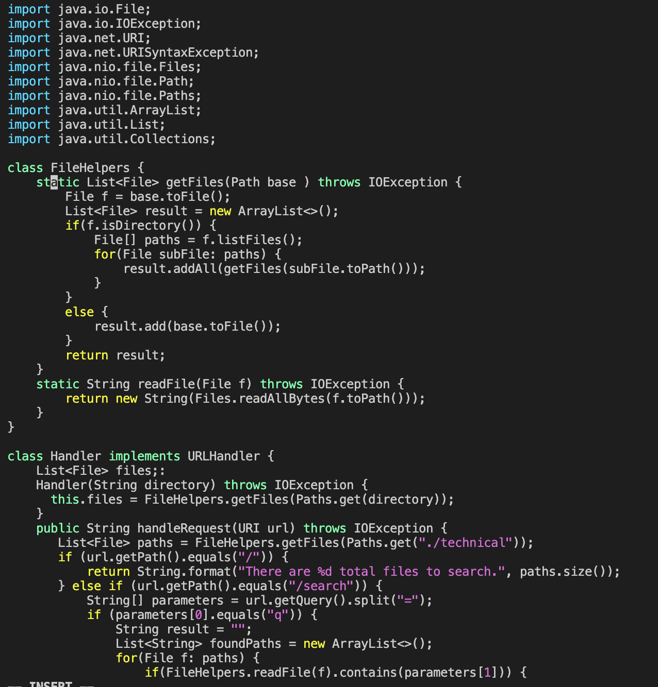

#  Lab Report 4
## *Advita Sekar*

[Home](index.html)

## Part 1 <br />

The steps to complete the task of changing the name of the start parameter and its uses to base in the file DocSearchServer.java in week6-skill-demo1 are given below: <br />

1. cd into the directory `week6-skill-demo1` by using the command :<br />
`cd week6-skill-demo1`
2. Use the command `vim DocSearchServer.java` in order to enter the file on the remote server. <br /> 
3. Go into insert mode using the `i` key. <br />
4. Scroll to the `class FileHelpers` and go to the first occurence of the `start` parameter in the line: <br />
``` 
static List <File> getFiles(Path start) throws IOException{
```
 Use < backspace > 5 times and delete start and enter `base` in place of it. <br /> 
 Then scroll and click on the `start` paramter in the next occurence in the line:
```
File F= start.toFile();
```
Use < backspace > 5 times and delete start and enter `base` in place of it. <br />
Then scroll and click on the `start` paramter in the next occurence in the line:
```
 result.add(start.toFile());
 ```
 Use < backspace > 5 times and delete start and enter `base` in place of it. <br />
 Now, you have successfully entered `base` in place of the `start` paramter at all of its occurences. <br />
5. Escape insert mode using < Esc >. Then in order to save the changes and exit the file, use `:wq` and then < Enter >  <br />
6. The changed code should look like this: <br />
 <br />

## Part 2 <br />

It took me about 3 minutes to make the edits in Visual Studio code, `scp` the files to the remote server and then run the tests. On the other hand, it took me only 65 seconds to log in to ieng6 and make the edit on the remote server using the `vim` command.  <br />
 
I prefer using the `vim` command to make edits on the remote server since in my opinion, it's more efficient and less time consuming. However, if there is a considerable amount of code that needs to be changed, it will be a lot easier to use the other method of making the changes on Visual Studio Code and then using `scp` to move the files to the remote server.
