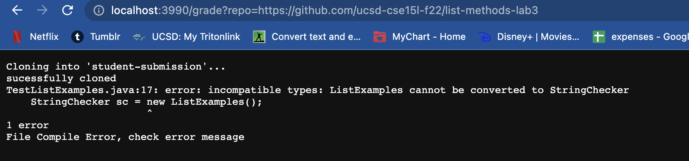
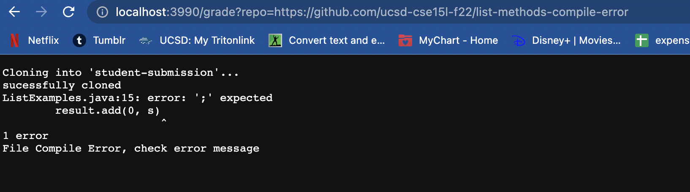
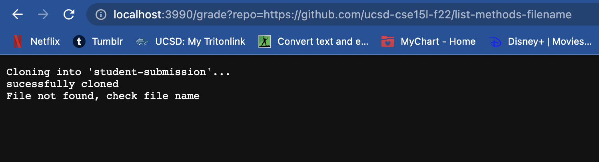

# Lab Report 5
## *Advita Sekar*

[Home](indes.html)

### Autograder bash script in `grade.sh` <br />

```
CP= ".:../lib/hamcrest-core-1.3.jar:../lib/junit-4.13.2.jar"


rm -rf student-submission
git clone $1 student-submission

echo "sucessfully cloned"

cd student-submission

if [[ ! -f ListExamples.java ]]
then
    echo "File not found"
    exit 1
fi

cd ..
cp *.java student-submission/
cp -r lib student-submission/
cd student-submission/

javac -cp $CP *.java

if [[ $? -ne 0 ]]
    then
    echo "File Compile Error, check error message"
    exit 1
fi

java -cp $CP org.junit.runner.JunitCore TestListExamples

if [[ $? -ne 0]]
then 
echo "Tests failed"
else
echo "All tests passed"
fi 

``` 

Below are 3 screenshots of 3 different student submissions and the grade that is reported on the browser : <br />

 <br />
This has an incompatible type as StringChecker cannot be converted to ListExamples. <br />

 <br />
This shows a syntax error due to a missing `;` which produces a compile error. <br />

This is a trace of the bash script: <br />
1. In this case, the standard output is empty. The standard error is a compile error due to the missing semicolon. <br />
2. The return code is non-zero as it is 1. <br />
3. The first `if` statement checks for the correct file, which is ListExamples.java. This student has submitted the correct file so the first statment returns true. The second `if` statement checks for a compile error which exists in the student submission file so this statemetn returns false. The third `if` statement checks for whether all the tests past or fail. However, there is an exit that occurs before this statement since the previous one returned false due to a compile error. Thus, this `if` statement is not evaluated due to an early exit.<br />

 <br />
This has the implementation saved in the incorrect file with the wrong name. <br />


